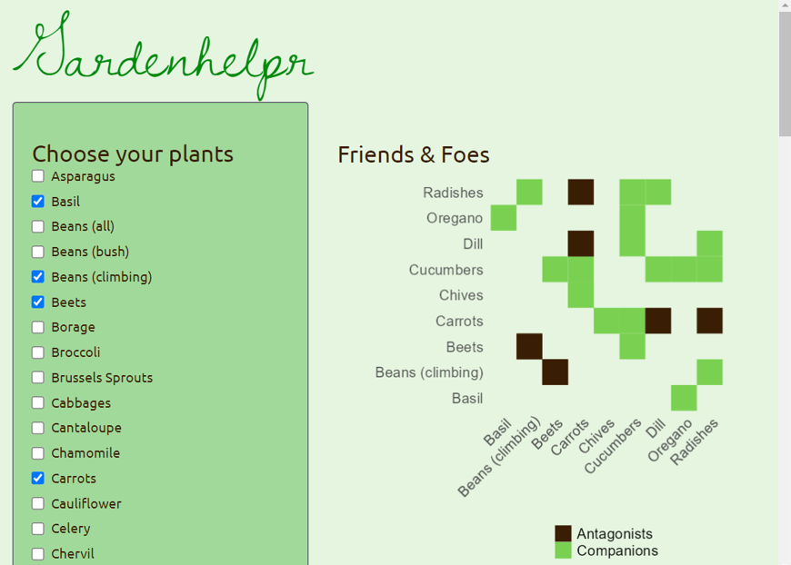

# gardenhelpr
[In development] An R Shiny app to assist in backyard garden planning, from pH to plant relationships

## Functionality 

Based on your input of desired garden plants, gardenhelpr will:

- Generate planting recommendations based on phytosociology (i.e. what vegatables should/should not be planted together)
- Calculate the average ideal soil pH 
- Calculate average watering needs
- Calculate average sunlight requirements
- Report pH, water, and sunlight outliers so they can be planted separately

## Data sources

- Companion planting data sourced from: <a href="https://waldenlabs.com/the-ultimate-companion-planting-guide-chart/">Walden Labs</a>

## Suggested reading

### Companion Planting
- Burpee: https://www.burpee.com/blog/companion-planting-guide_article10888.html
- Farmer's Almanac: https://www.almanac.com/companion-planting-guide-vegetables#
- Gardening Data: https://www.gardeningdata.co.uk/powen/guides/companion-planting.php
- World Water Reserve: https://worldwaterreserve.com/companion-planting-charts-guides-pdfs/
 
